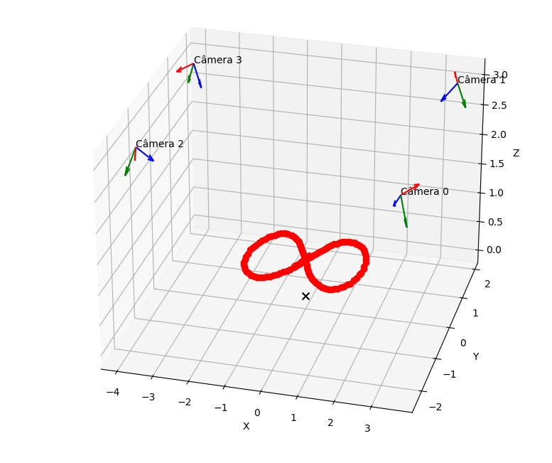
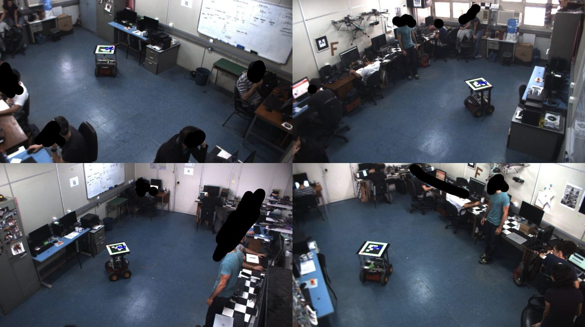

# Reconstrução 3D de Posição do Robô com ArUco

Este repositório contém o código para detectar um robô equipado com um marcador ArUco em vídeos sincronizados de 4 câmeras e reconstruir a sua posição 3D no mundo. A partir dos dados de calibração fornecidos (arquivos JSON), o código realiza a triangulação linear para estimar a posição do marcador (identificado como ArUco de código 0) e, em seguida, plota a trajetória do robô em um gráfico 3D.

## Teoria Matemática  

A reconstrução 3D a partir de imagens baseia-se no princípio da **triangulação**. Para cada câmera, a projeção de um ponto \\( \mathbf{X} \\) no espaço (em coordenadas homogêneas) é dada por:  

\\[
m \sim P X, \quad \text{com} \quad m = [u, v, 1]^T
\\]

onde a matriz de projeção \\( \mathbf{P} \\) é construída a partir dos parâmetros **intrínsecos** e **extrínsecos** da câmera. Se os arquivos de calibração fornecem a pose da câmera (posição \\( \mathbf{T} \\) e orientação \\( \mathbf{R} \\) no mundo), a matriz de projeção pode ser escrita como:  

\\[
P = K 
\begin{bmatrix} 
R^T & -R^T T 
\end{bmatrix}
\\]

Cada câmera que detecta o marcador gera as seguintes equações para as coordenadas \\( u \\) e \\( v \\):  

\\[
u \left(\mathbf{P}_{3,:} \mathbf{X}\right) - \left(\mathbf{P}_{1,:} \mathbf{X}\right) = 0
\\]

\\[
v \left(\mathbf{P}_{3,:} \mathbf{X}\right) - \left(\mathbf{P}_{2,:} \mathbf{X}\right) = 0
\\]

Empilhando essas equações de pelo menos **duas câmeras**, obtemos um sistema linear da forma:  

\\[
A X = 0
\\]

A solução para \\( \mathbf{X} \\) é obtida através da **decomposição em valores singulares (SVD)** do sistema. A solução corresponde à **última coluna da matriz** \\( \mathbf{V} \\) (ou última linha de \\( \mathbf{V}^T \\)), que é então convertida de **coordenadas homogêneas para cartesianas**.

## Requisitos

- Python 3.x
- OpenCV (versão 4.x)
- NumPy
- Matplotlib

## Arquivos do Projeto

- `main.py`: Código principal para detecção, reconstrução 3D e plotagem da trajetória.
- `0.json`, `1.json`, `2.json`, `3.json`: Arquivos de calibração das 4 câmeras, contendo os parâmetros intrínsecos, extrínsecos e coeficientes de distorção.
- `camera-00.mp4`, `camera-01.mp4`, `camera-02.mp4`, `camera-03.mp4`: Vídeos sincronizados capturados pelas 4 câmeras.



## Como Executar

1. Garanta que os arquivos de calibração (JSON) e os vídeos estejam no mesmo diretório do script `main.py`.
2. Instale as dependências necessárias:
   ```bash
   pip install opencv-python numpy matplotlib
   ```
3. Execute o script:
   ```bash
   python main.py
   ```
   O programa abrirá uma janela exibindo os frames combinados das 4 câmeras e, em paralelo, um gráfico 3D interativo com a trajetória estimada do robô.

## Funcionamento do Código

- **Detecção ArUco:**  
  O código utiliza a função `aruco.detectMarkers` do OpenCV para identificar o marcador ArUco (ID 0) em cada frame dos vídeos.

- **Calibração e Parâmetros da Câmera:**  
  Cada câmera possui um arquivo JSON que fornece a matriz intrínseca \( \mathbf{K} \), a matriz de rotação \( \mathbf{R} \), o vetor de translação \( \mathbf{T} \) e os coeficientes de distorção. Esses dados são lidos pela função `camera_parameters`.

- **Reconstrução 3D (Triangulação):**  
  A função `reconstruct_3d_position` monta um sistema linear a partir das equações de projeção para as câmeras que detectam o marcador. Usando SVD, o código resolve o sistema para obter a posição 3D \( \mathbf{X} \) do marcador.

- **Plotagem da Trajetória:**  
  As posições 3D estimadas são acumuladas em um histórico (`X_hist`) e a trajetória é atualizada iterativamente em um gráfico 3D utilizando Matplotlib. Além disso, os eixos das câmeras são desenhados para referência.




